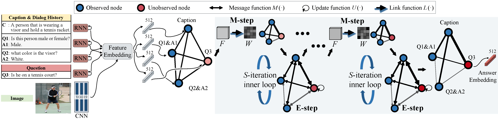

# Reasoning Visual Dialogs with Structural and Partial Observations

Pytorch Implementation for the paper:

**[Reasoning Visual Dialogs with Structural and Partial Observations](https://arxiv.org/abs/1904.05548)**  
[Zilong Zheng](http://web.cs.ucla.edu/~zilongzheng/)<sup>\*</sup>, [Wenguan Wang](https://sites.google.com/site/wenguanwangwwg/)<sup>\*</sup>, [Siyuan Qi](http://web.cs.ucla.edu/~syqi/)<sup>\*</sup>, [Song-Chun Zhu](http://www.stat.ucla.edu/~sczhu/) (* equal contributions)  
In CVPR 2019 (Oral)



## Getting Started

 This codebase is tested using Ubuntu 16.04, Python 3.5 and a single NVIDIA TITAN Xp GPU. Similar configurations are preferred.

### Installation
- Clone this repo:
```bash
git clone https://github.com/zilong/visdial-gnn.git
cd visdial-gnn
```
- Install requirements
    - [Pytorch](http://pytorch.org) 0.4.1
    - For other Python dependencies, run: 
        ```
        pip install -r requirements.txt
        ```

### Train/Evaluate VisDial v1.0
- We use pre-extracted image features as specified [here](https://github.com/batra-mlp-lab/visdial#preprocessing-visdial) for VisDial v1.0.

- We use preprocessed dialog data as specified [here](https://github.com/batra-mlp-lab/visdial#preprocessing-visdial)
- To reproduce our results, you can download preprocessed data and save it to `$PROJECT_DIR/data/v1.0/` by
```bash
bash ./scripts/download_data_v1.sh faster_rcnn
```
- To train a discriminative model, run:
```bash
#!./scripts/train_v1_faster_rcnn.sh
python train.py --dataroot ./data/v1.0/
```
- To evaluate the model using val split, run:
```bash
python evaluate.py --dataroot ./data/v1.0/ --split val --ckpt /path/to/checkpoint
```

### Train/Evaluate VisDial v0.9
- We use pre-extracted image features from VGG-16 and VGG-19 as specified [here](https://github.com/batra-mlp-lab/visdial#extracting-image-features)
- To download preprocessed data (e.g. vgg19) and save it to `$PROJECT_DIR/data/v0.9/`, run
```bash
bash ./scripts/download_data_v09.sh vgg19
```
- To train a discriminative model using vgg19 pretrained image features, run
```bash
#!./scripts/train_v09_vgg19.sh
python train.py --dataroot ./data/v0.9/ \
                --version 0.9 \
                --img_train data_img_vgg19_pool5.h5 \
                --visdial_data visdial_data.h5 \
                --visdial_params visdial_params.json \
                --img_feat_size 512
```

## Citation

If you use this code for your research, please cite our paper.
```
@inproceedings{zheng2019reasoning,
    title={Reasoning Visual Dialogs with Structural and Partial Observations},
    author={Zheng, Zilong and Wang, Wenguan and Qi, Siyuan and Zhu, Song-Chun},
    booktitle={Computer Vision and Pattern Recognition (CVPR), 2019 IEEE Conference on},
    year={2019}
}
```

## Acknowledgments

We use [Visual Dialog Challenge Starter Code](https://github.com/batra-mlp-lab/visdial-challenge-starter-pytorch) and [GPNN](https://github.com/SiyuanQi/gpnn) as referenced util code.
